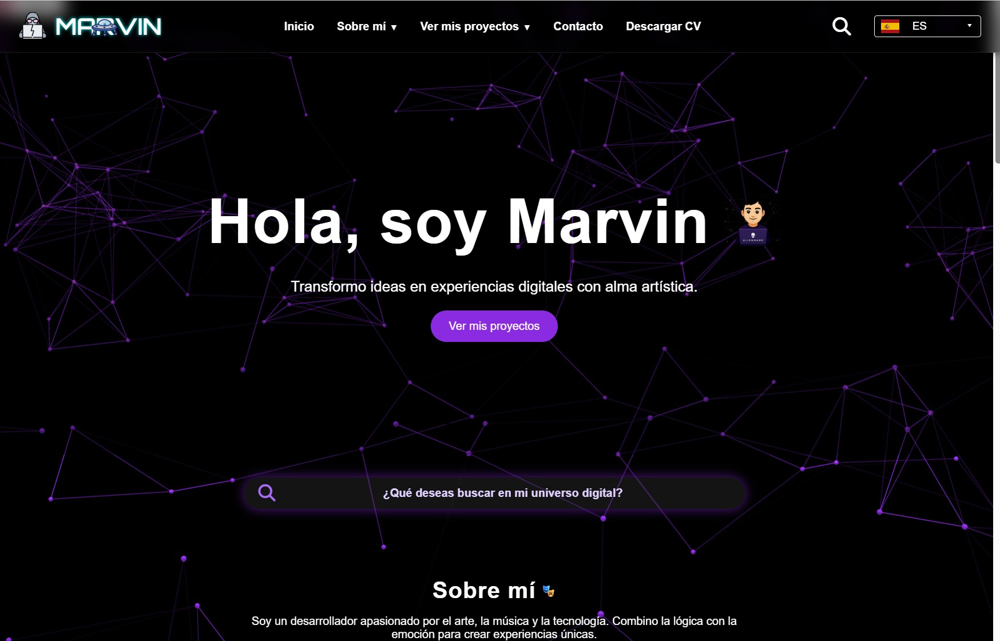

# 🚀 Portfolio Marvin Egoavil 👨‍💻✨

[](https://www.marvinegoavil.com)
[](https://www.marvinegoavil.com)
[](https://github.com/MarvinEgoavil)

¡Bienvenido a mi portfolio personal!  
Un espacio cósmico donde la tecnología, el arte y la creatividad se encuentran 🚀✨

---

## 🌟 Características principales

- ✨ **Fondo animado** con Vanta.js y Three.js
- 🌐 **Multilingüe:** Español, Inglés, Francés y Quechua
- 🎨 **Diseño artístico y cósmico** con efectos visuales únicos
- 📱 **100% Responsive** (móvil, tablet y escritorio)
- ⚡ **Puro Vanilla JS, HTML y CSS** — ¡No se usaron plantillas ni frameworks!
- 🛠️ **Código modular, limpio y escalable**
- 🔥 **Animaciones personalizadas** y UI única
- 👀 **Interactividad y dinamismo** en cada sección
- 💡 **Sin dependencias pesadas**: solo librerías visuales (Three.js, Vanta.js, FontAwesome)

---

## 🚀 Tecnologías utilizadas

| HTML5 | CSS3 | JavaScript | Vanta.js | Three.js | FontAwesome |
|:-----:|:----:|:----------:|:--------:|:--------:|:-----------:|
|   ✅  |  ✅  |     ✅     |    ✅    |    ✅    |     ✅      |

---

## 📸 Vista previa

 <!-- Puedes subir una captura como preview.png -->

---

## 🗂 Estructura del proyecto

```
/
├── assets/        # Imágenes, íconos, ovnis, emojis, etc.
├── css/           # Hojas de estilo (modular)
├── js/            # Scripts JS (modular)
├── json/i18n/     # Archivos de traducción
├── index.html     # Archivo principal
└── README.md
```

---

## ⚙️ Cómo ejecutar el proyecto

1. **Clona el repositorio:**
   ```bash
   git clone https://github.com/MarvinEgoavil/tu-repo.git

2. Abre el archivo index.html en tu navegador favorito.

3. ¡Disfruta explorando el universo de mi portfolio!


📬 Contacto
🌐 marvinegoavil.com

📧 marvinegoavilz@gmail.com

📱 +34 722 516 228

Este proyecto es 100% original, sin plantillas, hecho desde cero con amor por el código, el arte y la tecnología.

¡Déjame tus estrellas ⭐ y comentarios si te gustó!

